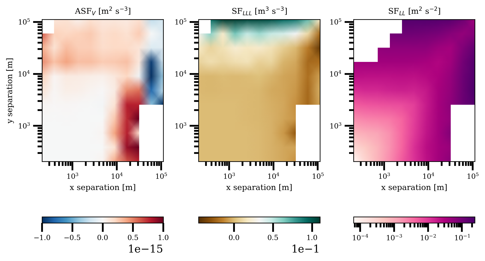

# Summary

Structure functions are fundamental diagnostic tools in turbulence research that quantify spatial correlations between field differences at varying separation distances, revealing energy cascade characteristics and scaling laws [@Frisch1995; @Pope2000]. PyTurbo_SF is a comprehensive Python package providing efficient, statistically rigorous structure function calculations for 1D, 2D, and 3D turbulent datasets through an innovative adaptive bootstrap framework.

<<<<<<< HEAD
The package addresses computational bottlenecks through power-of-2 spacing strategies, adaptive convergence monitoring, and memory-optimized algorithms. PyTurbo_SF delivers robust uncertainty quantification through bootstrap resampling and supports diverse (conditional) structure function types including longitudinal, transverse, scalar, advective, and energy flux functions [@Pearson2021; @Pearson2024].
=======
The package addresses computational bottlenecks through power-of-2 spacing strategies, adaptive convergence monitoring, and memory-optimized algorithms. PyTurbo_SF delivers robust uncertainty quantification through bootstrap resampling and supports diverse structure function types including longitudinal, transverse, scalar, advective, and energy flux functions [@Pearson2021; @Pearson2024].
>>>>>>> a204517c41958803e48d06e78c5c6b50e8b2929d

Applications span oceanographic time series and satellite measurements to high-resolution simulations, enabling consistent methodology across scales from laboratory to planetary systems.

# Statement of need

Contemporary turbulence research relies on massive datasets from satellite missions, autonomous platforms, and high-resolution simulations. Traditional structure function calculations face severe limitations: computational intractability for large datasets, absence of uncertainty quantification, manual parameter tuning, and limited function types.

Existing tools address only subsets of these challenges. fastSF provides parallelized implementations but lacks advanced function types and uncertainty quantification [@Sadhukhan2021]. MATLAB toolkits are environmentally limited and lack comprehensive statistical frameworks [@Fuchs2022]. Alternative approaches like FlowSieve cannot provide the scale-by-scale information structure functions uniquely deliver [@Storer2023].

There is a growing need for tools to analyze emerging datasets from NASA's SWOT satellite and next-generation atmospheric simulations generating terabyte-scale outputs. Recent advances in structure function theory, particularly advective structure functions [@Pearson2021] and spectral flux estimation [@Pearson2024], require frameworks handling both traditional and novel function types with statistical rigor.

PyTurbo_SF fills this gap by providing the first comprehensive, statistically robust framework that scales from small observational datasets to massive simulation outputs while delivering quantified uncertainties essential for scientific interpretation.

# Software functionality

PyTurbo_SF implements the complete mathematical framework for structure function analysis, supporting functions of the form $S_n(r) = \langle |\phi(\mathbf{x} + \mathbf{r}) - \phi(\mathbf{x})|^n \rangle_{\mathbf{x}}$ where $\phi$ represents arbitrary field variables (velocity, scalars, derived quantities), $\mathbf{r}$ is the separation vector, $n$ is the order, and $\langle \cdot \rangle_{\mathbf{x}}$ denotes spatial averaging. The package supports traditional functions (longitudinal, transverse, scalar), cross functions, and advective structure functions enabling direct energy flux quantification [@Pearson2021].

The core algorithmic breakthrough is adaptive bootstrap methodology increasing computational efficiency and statistical reliability. The algorithm employs power-of-2 spacings optimizing memory access patterns while providing optimal scale separation. Adaptive convergence monitoring dynamically allocates computational resources, eliminating manual parameter tuning while guaranteeing robust uncertainty estimates.

Performance optimization enables analysis of previously intractable datasets. Memory-efficient structures maintain peak usage at 2-5× base dataset size. Parallel processing provides near-linear scaling with available cores. Benchmark testing demonstrates O(NM log N log M) complexity for 2D data, enabling analysis of datasets with millions of grid points.

The package provides three main interfaces: bin_sf_1d() for time series, bin_sf_2d() for surface fields, and bin_sf_3d() for volumetric data. All functions automatically optimize computational strategies while supporting both isotropic and directional analysis.

# Related work and scientific impact

PyTurbo_SF represents a significant advancement by uniquely combining comprehensive function types, adaptive bootstrap methodology, and optimized algorithms. While fastSF provides basic parallelized calculations [@Sadhukhan2021] and MATLAB toolkits offer specific analyses [@Fuchs2022], no existing software delivers the combination of statistical rigor, efficiency, and breadth required for contemporary turbulence research.

The package enables application of recent theoretical developments, particularly advective structure functions providing direct energy flux measurements [@Pearson2021] and spectral flux estimation methodologies [@Pearson2024]. These reveal energy pathways traditional approaches cannot capture, offering insights into cascade mechanisms in ocean and atmospheric turbulence.

Scientific applications demonstrate transformative impact across domains. PyTurbo_SF enables analysis of satellite altimetry data for characterizing surface turbulence and large eddy simulation data for understanding boundary layer dynamics. The consistent methodology enables comparative studies previously impossible due to software limitations.

The adaptive bootstrap framework addresses a fundamental challenge: quantifying uncertainties in structure function estimates. PyTurbo_SF's principled uncertainty quantification enables robust statistical comparisons and hypothesis testing, elevating scientific standards.

# Acknowledgements

This software package is based upon work supported by the US Department of Energy grant DE-SC0024572.

Any opinions, findings, and conclusions or recommendations expressed in this package are those of the authors and do not necessarily reflect the views of the US Department of Energy.

# References
